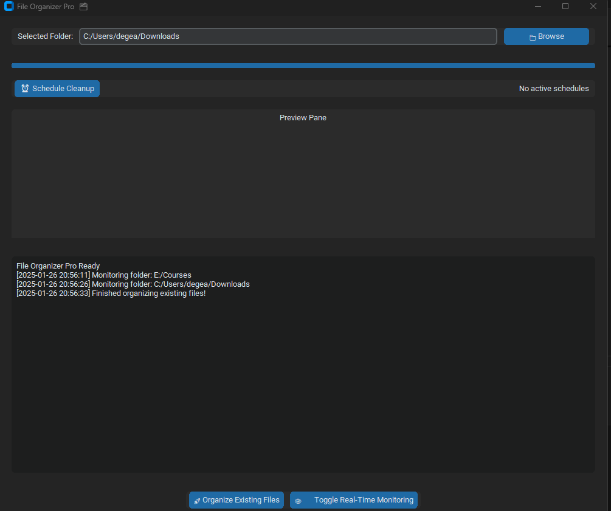

# File Organizer Pro 🗂️

**Smart File Management with Real-Time Monitoring, Scheduling, and Previews**

  

---

## 📝 Description  
**File Organizer Pro** is a powerful, feature-rich desktop application designed to automate file organization with modern AI-like capabilities. Built with Python and a sleek GUI, it intelligently categorizes files, detects duplicates, monitors folders in real-time, and even generates previews—all while running discreetly in your system tray. Perfect for users drowning in cluttered directories!

---

## ✨ Key Features  
- **Smart Categorization**: Automatically sorts files into `Documents`, `Images`, `Media`, `Code`, and more.  
- **Real-Time Monitoring** 👁️: Watches your folder for changes and organizes files instantly.  
- **Duplicate Detection**: Uses MD5 hashing to identify and move duplicates to a dedicated folder.  
- **Scheduled Cleanups** ⏰: Set daily/weekly automated organization tasks.  
- **File Previews** 🖼️: Generates thumbnails for images, PDFs, and text snippets.  
- **System Tray Integration**: Minimize to the tray and receive notifications.  
- **Custom Rules** 🛠️: Define your own file-matching rules via JSON configuration.  
- **Cross-Platform** 🌐: Works on Windows, macOS, and Linux.  

---

## 📦 Installation  
1. **Clone the Repository**  
   ```bash
   git clone https://github.com/your-username/file-organizer-pro.git
   cd file-organizer-pro
   ```

2. **Install Dependencies**  
   ```bash
   pip install -r requirements.txt
   ```

   **Requirements**:  
   ```plaintext
   customtkinter
   watchdog
   pystray
   schedule
   pdfplumber
   pillow
   keyring
   ```

3. **Run the Application**  
   ```bash
   python file_organizer.py
   ```

---

## 🖥️ Usage  
1. **Select a Folder**: Click **Browse** to choose the directory you want to organize.  
2. **Organize Existing Files**: Click **🚀 Organize Existing Files** to sort all current files.  
3. **Toggle Real-Time Monitoring**: Enable **👁️ Toggle Real-Time Monitoring** to auto-organize new files.  
4. **Schedule Cleanups**: Set recurring tasks (e.g., "daily at 22:00") via the **⏰ Schedule Cleanup** button.  
5. **Preview Files**: Right-click log entries to preview images, PDFs, or text snippets.  
6. **Minimize to Tray**: Close the window to keep the app running in the background.  

---

## ⚙️ Configuration  
- **Custom Rules**: Edit `~/.file_organizer_config.json` to add patterns and categories:  
  ```json
  {
    "pattern1": "Category1",
    "pattern2": "Category2"
  }
  ```
- **Schedules**: Stored in `~/.file_organizer_schedule.json`.  


---

## 📜 License  
Distributed under the MIT License. See `LICENSE` for details.  

---

##  Acknowledgments  
- Libraries: `customtkinter`, `watchdog`, `pystray`, `pdfplumber`, `pillow`.  

--- 

**Say goodbye to chaos—let File Organizer Pro handle your files!** 🚀
